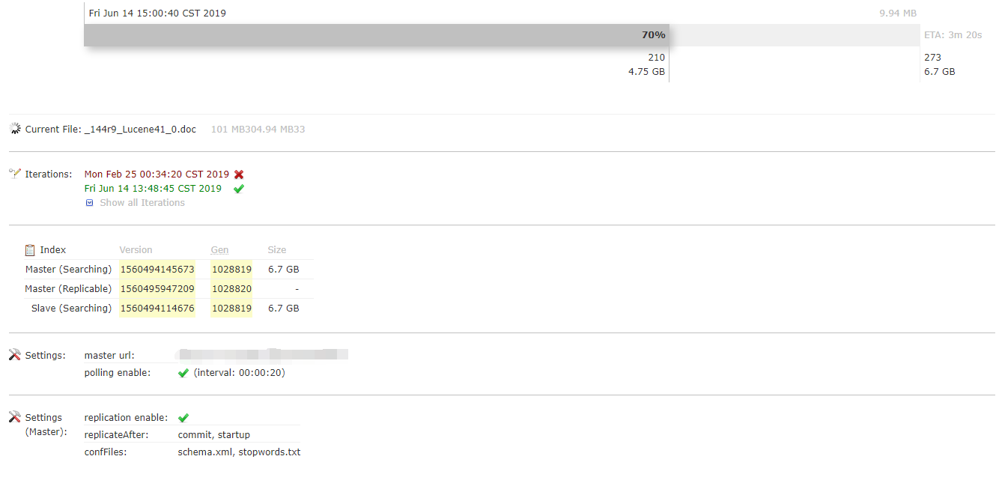

## Solr 安装与部署
#### 前言

Solr 是一种可供企业使用的、基于 Lucene 的搜索服务器，它支持层面搜索、命中醒目显示和多种输出格式。在这篇文章中，将介绍 Solr 并展示如何轻松地将其表现优异的全文本搜索功能加入到 Web 应用程序中。

下载地址：https://lucene.apache.org/solr/downloads.html

本文中使用的Solr 版本：7.7.2，因为我是用的是 Windows 系统，所以主要介绍的是 Windows 下的部署方法。

#### 安装
Solr 内置了 Jetty，所以不需要任何安装任何 Web 容器即可运行。直接通过命令行就可以启动。
启动 Solr：
```shell
 .\solr.cmd start
```
停止 Solr：
```shell
 .\solr.cmd stop -all
```
#### 创建 Core
schema.xml 文件：

dataconfig.xml 文件的大致结构如下：


#### 配置数据源
Solr 的 Api 是支持通过调用接口添加数据的，但是在实际使用中我们都是从数据库中同步数据，所以我们需要为 Solr 配置数据源。

* query 查询只对第一次全量导入有作用，对增量同步不起作用。
* deltaQuery 的意思是，查询出所有经过修改的记录的 Id 可能是修改操作，添加操作，删除操作产生的（此查询只对增量导入起作用，而且只能返回 Id 值）
* deletedPkQuery 此操作值查询那些数据库里伪删除的数据的 Id、solr 通过它来删除索引里面对应的数据（此查询只对增量导入起作用，而且只能返回 Id 值）。
* deltaImportQuery 是获取以上两步的 Id，然后把其全部数据获取，根据获取的数据 对索引库进行更新操作，可能是删除，添加，修改(此查询只对增量导入起作用，可以返回多个字段的值,一般情况下，都是返回所有字段的列）。
* parentDeltaQuery 是从本 entity 中的 deltaquery 中取得参数。

##### 使用 MySQL 数据源

##### 使用 SQL Server 数据源


#### 中文分词

将 `contrib\analysis-extras\lucene-libs` 目录中的 `lucene-analyzers-smartcn-7.7.2.jar` 复制到 `server\solr-webapp\webapp\WEB-INF\lib` 目录下，否则会报错。
在 `managed-shchema` 中添加如下代码：
```xml
  <!-- 配置中文分词器 -->
  <fieldType name="text_cn" class="solr.TextField">
    <analyzer type="index">
      <tokenizer class="org.apache.lucene.analysis.cn.smart.HMMChineseTokenizerFactory" />
    </analyzer>
    <analyzer type="query">
      <tokenizer class="org.apache.lucene.analysis.cn.smart.HMMChineseTokenizerFactory" />
    </analyzer>
  </fieldType>
```
把需要使用中文分词的字段类型设置成 `text_cn`：
```xml
<field name="Remark" type="text_cn" indexed="true" stored="true" multiValued="false"/>
```

#### 主从部署
Solr 复制模式，是一种在分布式环境下用于同步主从服务器的一种实现方式，因之前提到的基于 rsync 的 SOLR 不同方式部署成本过高，被 Solr 1.4 版本所替换，取而代之的就是基于 HTTP 协议的索引文件传输机制，该方式部署简单，只需配置一个文件即可。Solr 索引同步的是 Core 对 Core，以 Core 为基本同步单元。
主服务器 `solrconfig.xml` 配置：
```xml
<requestHandler name="/replication" class="solr.ReplicationHandler">
    <lst name="master">
        <!-- 执行 commit 操作后进行 replicate 操作同样的设置'startup', 'commit', 'optimize'-->
        <str name="replicateAfter">commit</str>
        <!-- 执行 startup 操作后进行 replicate 操作 -->
        <str name="replicateAfter">startup</str>
        <!-- 复制索引时也同步以下配置文件 -->
        <str name="confFiles">schema.xml,stopwords.txt</str>
        <!-- 每次 commit 之后，保留增量索引的周期时间，这里设置为 5 分钟。 -->
        <str name="commitReserveDuration">00:05:00</str>  
        <!-- 验证信息，由用户自定义用户名-->
        <!-- <str name="httpBasicAuthUser">root</str> -->
        <!-- 验证信息，由用户自定义密码 -->
        <!-- <str name="httpBasicAuthPassword">password</str> -->
    </lst>
    <!--
       <lst name="slave">
         <str name="masterUrl">http://your-master-hostname:8983/solr</str>
         <str name="pollInterval">00:00:60</str>
       </lst>
    -->
</requestHandler>
```
从服务器 `solrconfig.xml` 配置：
```xml
<requestHandler name="/replication" class="solr.ReplicationHandler">
    <lst name="slave">
        <!-- 主服务器的同步地址 -->
        <str name="masterUrl">http://192.168.1.135/solr/posts</str>
        <!-- 从服务器同步间隔，即每隔多长时间同步一次主服务器 -->
        <str name="pollInterval">00:00:60</str>
        <!-- 压缩机制，来传输索引，可选 internal|external，internal：内网，external：外网 -->
        <str name="compression">internal</str>
        <!-- 设置连接超时（单位：毫秒） -->
        <str name="httpConnTimeout">50000</str>
        <!-- 如果设置同步索引文件过大，则应适当提高此值。（单位：毫秒） -->
        <str name="httpReadTimeout">500000</str>
        <!-- 验证用户名，需要和 master 服务器一致 -->
        <!-- <str name="httpBasicAuthUser">root</str> -->
        <!-- 验证密码，需要和 master 服务器一致 -->
        <!-- <str name="httpBasicAuthPassword">password</str> -->
    </lst>
</requestHandler>
```
Solr 主从同步是通过 Slave 周期性轮询来检查 Master 的版本，如果 Master 有新版本的索引文件，Slave 就开始同步复制。
* 1、Slave 发出一个 filelist 命令来收集文件列表。这个命令将返回一系列元数据（size、lastmodified、alias 等信息）。
* 2、Slave 查看它本地是否有这些文件，然后它会开始下载缺失的文件（使用命令 filecontent）。如果与 Master 连接失败，就会重新连接，如果重试 5 次还是没有成功，就会 Slave 停止同步。
* 3、文件被同步到了一个临时目录（`index.时间戳` 格式的文件夹名称，例如：index.20190614133600008）。旧的索引文件还存放在原来的文件夹中，同步过程中出错不会影响到 Slave，如果同步过程中有请求访问，Slave 会使用旧的索引。
* 4、当同步结束后，Slave 就会删除旧的索引文件使用最新的索引。

我们项目中 6.7G 的索引文件（279 万条记录），大概只用了 12 分钟左右就同步完成了，平均每秒的同步速度大约在 10M 左右。



##### 注意事项
如果主从的数据源配置的不一致，很可能导致从服务器无法同步索引数据。

#### 在项目中使用 Solr

##### 在 Java 项目中使用 Solr
SolrJ 是 Solr 的官方客户端，文档地址：[https://lucene.apache.org/solr/7_7_2/solr-solrj/](https://lucene.apache.org/solr/7_7_2/solr-solrj/)。
使用 maven 添加：
```xml
<!-- https://mvnrepository.com/artifact/org.apache.solr/solr-solrj -->
<dependency>
    <groupId>org.apache.solr</groupId>
    <artifactId>solr-solrj</artifactId>
    <version>7.7.2</version>
</dependency>
```
配置 `application.properties`：
```properties
solr.servers=http://192.168.1.25:8099/solr/,http://192.168.1.26:8099/solr/
```


##### 在  DotNet 项目中使用 Solr

SolrNet：https://github.com/mausch/SolrNet

##### 在 Python 项目中使用 Solr

PySolr：https://github.com/django-haystack/pysolr
使用 `pip` 安装 pysolr：
```shell
pip install pysolr
```
简单的查询：
```python
# -*- coding: utf-8 -*-
import pysolr

SOLR_URL = 'http://localhost:8983/solr/posts'


def add():
    """
    添加
    """
    solr = pysolr.Solr(SOLR_URL)
    result = solr.add([
        {
            'id': '10000',
            'post_title': 'test-title',
            'post_name': 'test-name',
            'post_excerpt': 'test-excerpt',
            'post_content': 'test-content',
            'post_date': '2019-06-18 14:56:55',
        }
    ])
    print(result)

def query():
    """
    查询
    """
    solr = pysolr.Solr(SOLR_URL)
    results = solr.search('苹果')
    print(results.docs)


if __name__ == "__main__":
    add()
    query()
```